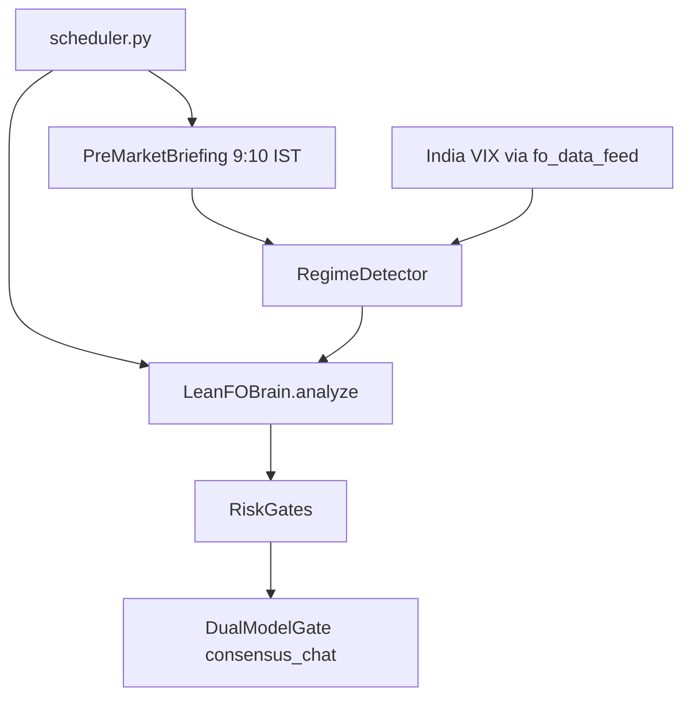

# Pro Trading Agent Upgrade — Living Tracker

**Purpose:** This document is the single source of truth for the “pro upgrade” roadmap. **Before each implementation session:** read “Current state” and “Next actions”. **After each phase:** update status, files changed, and notes for the next builder.

**Do not edit the Cursor plan file** (`pro_trading_agent_upgrade_*.plan.md`); this repo file is the operational tracker.

---

## Vision

- Regime-aware F&O: classify the session (trend / range / vol / expiry) before directional trades.
- Maximum LLM value: structured JSON outputs; Proxima **dual-model** consensus on rare `EXECUTE` decisions.
- F&O first; equity parity (Phase I) deferred.
- No guarantee of “crazy profits”; goal is **process quality**, **risk control**, and **repeatable edge**.

---

## Phase checklist

| Phase | Description | Status |
|-------|-------------|--------|
| **A** | Market regime (India VIX), `RegimeDetector`, pre-market briefing, wire into `LeanFOBrain` + scheduler | **DONE** (2026-05-11) |
| **B** | Dual-model `consensus_chat` gate on `EXECUTE` (Proxima only) | **DONE** (2026-05-11) |
| **C** | `llm/schemas.py` + JSON prompts + parse fallbacks in analysts / client | **DONE** (2026-05-11) |
| **T0** | Live Safety Hardening (GTT cancel, fill verification, orphan flatten, post-market order) | **DONE** (2026-05-11) |
| **D** | Strategy arsenal (credit spreads for range days) | Deferred / disabled (2026-05-12) |
| **E** | Delta-based strikes + conviction sizing | Not started |
| **F** | OI change + VWAP overlays in signals | **DONE** (2026-05-12) |
| **G** | Theta-aware / ATR exits | **DONE** (2026-05-12) |
| **H** | Nightly reflection loop wired to briefing | Not started |
| **I** | Equity execution parity | Not started (low priority) |
| **SR** | Startup reconciliation (pending intents, broker truth, stale positions) | **DONE** (2026-05-12) |

---

## Architecture (post A+B+C)



---

## What was implemented (A + B + C)

### Phase C — Structured JSON

- Added [llm/schemas.py](llm/schemas.py): `parse_json_response`, schema strings, `normalize_news_from_json`, `normalize_fo_from_json`.
- [llm/client.py](llm/client.py): `news_analysis` and `trade_decision` system prompts require JSON; new `final_decision` prompt; `analyze_news` tries JSON first then legacy parse; `consensus_chat` parses JSON for `task_type=final_decision` (both models must return `decision: EXECUTE`).
- [agents/analysts/fo_analyst.py](agents/analysts/fo_analyst.py): F&O LLM prompt + response use JSON with legacy fallback.

**News:** [agents/analysts/news_analyst.py](agents/analysts/news_analyst.py) unchanged — it already uses `LLMClient.analyze_news()`, which now prefers JSON.

### Phase A — Regime

- [data_feeds/fo_data_feed.py](data_feeds/fo_data_feed.py): `get_india_vix()` (60s cache), key `NSE_INDEX|India VIX`.
- [brain/regime_detector.py](brain/regime_detector.py): `MarketRegime`, `RegimeSnapshot`, rule-based + optional LLM JSON refinement, `generate_pre_market_briefing()` writes `data_cache/day_plan_YYYY-MM-DD.json`.
- [brain/lean_fo_brain.py](brain/lean_fo_brain.py): `MarketContext` extended (`regime`, `vix`, `day_plan`, …); `_enrich_context_with_regime` after primary + fallback context; `_should_trade` blocks `RANGE_BOUND` / `LOW_VOL_GRIND` / `EXPIRY_DAY`; raises threshold for `HIGH_VOL_BREAKOUT` + VIX > 18.
- [scheduler.py](scheduler.py): exit thread calls `_try_pre_market_briefing()` in **9:10–9:14 IST** window (weekday, non-holiday), once per calendar day.

### Phase B — Dual gate

- [brain/lean_fo_brain.py](brain/lean_fo_brain.py): `_dual_model_execute_gate` → `consensus_chat(..., task_type="final_decision")`. Runs only if `LLMBackend.PROXIMA`. After risk gates approve, gate must pass or decision becomes `BLOCKED` with `blocked_by_gate=dual_model_gate`.

---

## Testing (quick)

```bash
cd trading-agent
./venv/bin/python -m pytest tests/test_gtt_logic.py tests/test_phase2.py -q
./venv/bin/python -c "from llm.schemas import parse_json_response; print(parse_json_response('{\"a\":1}'))"
```

---

## Directional-only context

- Directional index longs are **explicitly disabled** when regime is `range_bound` or `low_vol_grind`. No non-directional spread path is active.
- `day_plan_*.json` is optional; if missing, regime still works from rules + optional LLM in `detect()`.
- Dual gate adds latency only on rare `EXECUTE` after risk gates; keep it that way.

---

## Session log

### 2026-05-11 — Phases A, B, C implemented

- **Files changed:** `UPGRADE_PLAN.md`, `llm/schemas.py`, `llm/client.py`, `agents/analysts/fo_analyst.py`, `data_feeds/fo_data_feed.py`, `brain/regime_detector.py`, `brain/lean_fo_brain.py`, `scheduler.py`
- **Tests:** `14 passed` (existing suite).
- **Follow-ups:** Confirm Upstox instrument key for India VIX in production (`NSE_INDEX|India VIX`); tune regime thresholds from live data.

### 2026-05-11 — Tier 0: Live Safety Hardening

All 6 critical safety gaps from the second audit are now closed:

1. **GTT cancel blocks SELL when status unknown** (`exit_manager.py`): When `gtt_rule_status()` returns `ok=False`, we now try cancel + re-verify. If still unverifiable, `GTTCancelFailed` is raised and SELL is blocked. Post-cancel verification errors also raise instead of silently returning `None`.

2. **`_immediate_flatten` requires confirmed fill** (`lean_fo_executor.py`): Checks `filled_quantity` and `normalized=="complete"` before closing local state. If fill is unconfirmed, position stays OPEN locally and trading is frozen with manual-check alert.

3. **Entry fill timeout cancels pending order** (`lean_fo_executor.py`): New `_try_cancel_pending_order()` attempts `client.cancel_order()` on the unfilled BUY. If cancel also fails, trading is frozen — prevents silent orphan broker positions.

4. **Reconciliation `_try_flatten_orphan` verifies fill** (`reconciliation.py`): Now returns `bool` (fill confirmed). Checks `filled_quantity` / `normalized`. If fill unconfirmed, freezes trading and logs critical audit event.

5. **Post-market recovery: broker reconciliation FIRST** (`scheduler.py`): Reversed the order — runs `reconcile_state()` before touching local positions. Only closes stale local positions if broker is confirmed flat. If broker may still hold, local state is preserved and critical log emitted.

6. **Micro-live GTT failure: loud stderr warning** (`lean_fo_executor.py`): Prints conspicuous `CRITICAL` banner to stderr with instrument, decision_id, and "monitor manually" instruction. Known limitation documented in code.

- **Files changed:** `execution/exit_manager.py`, `execution/lean_fo_executor.py`, `execution/reconciliation.py`, `scheduler.py`, `UPGRADE_PLAN.md`
- **Tests:** `36 passed`, 2 pre-existing failures (equity import, connection test).
- **Strategic pushback addressed:** No naked short premium in micro-live. Non-directional spread strategies are disabled/deferred. Kelly sizing deferred. LLM remains classify/summarize/veto — does not own risk. Equity parity (Phase I) stays deferred.

### 2026-05-11 — Tier 0 audit round 2 (4 remaining gaps)

Third-party re-audit found 4 surviving bugs from the first T0 pass:

1. **GTT cancel: ok=False after OPEN→cancel still returned None** (`exit_manager.py` line 386): Changed `return None` → `raise GTTCancelFailed`. Now every code path where the GTT status cannot be confirmed as dead blocks the SELL.

2. **`_try_cancel_pending_order` ignored non-exception error responses** (`lean_fo_executor.py`): Now inspects `cancel_order()` return dict. If `status != "success"` (without raising), freezes trading with the response logged.

3. **`get_runtime_safety` did not exist — runtime ImportError** (`reconciliation.py`): Changed to `from execution import runtime_safety` and call `runtime_safety.set_trading_freeze()` directly. Also wired the `bool` return of `_try_flatten_orphan()` into the caller so orphan-flatten success/failure is reflected in the reconciliation report.

4. **Post-market: `ok=True` ≠ broker is flat** (`scheduler.py`): Now checks `report["broker_fo_positions"]` count. Only closes local state if broker has **0** F&O positions, regardless of `ok` flag. If broker has positions, local state is preserved and critical warning emitted.

- **Files changed:** `execution/exit_manager.py`, `execution/lean_fo_executor.py`, `execution/reconciliation.py`, `scheduler.py`, `UPGRADE_PLAN.md`
- **Tests:** `36 passed`, 2 pre-existing failures (equity import, connection test).
- **Import verified:** `from execution.reconciliation import _try_flatten_orphan` succeeds at runtime.

---

## Session: 2026-05-12 — Phases D, F, G, SR implemented

### Phase F — OI + VWAP (institutional data inputs)

- New `data_feeds/oi_analysis.py`: `OIBuildup` enum, `OISnapshot` dataclass, `analyze_oi_buildup()`, `find_sticky_strikes()`, `oi_concentration_bias()`, `build_oi_snapshot()`.
- `data_feeds/fo_data_feed.py`: Added `get_intraday_vwap(symbol)` (2-min cache, 1-min candles → VWAP calc) and `get_spot_atr(symbol)` (5-min cache, 30-min candles → ATR calc). Fixed `_is_cache_valid` to accept optional `max_age_s`.
- `brain/lean_fo_brain.py`: Extended `MarketContext` with `oi_buildup`, `oi_bias`, `sticky_call_strike`, `sticky_put_strike`, `vwap`, `spot_vs_vwap`. Populated in `_get_market_context`. Support/resistance now use sticky OI strikes.
- `_should_trade`: New Rule 6 — double divergence blocks (OI contradicts + VWAP contradicts = NO_TRADE). Single divergence reduces `signal_strength` by 5-8%.
- `_generate_signal`: OI sticky strikes inform strike selection (avoid strikes at institutional walls).
- `agents/analysts/fo_analyst.py`: LLM prompt includes OI buildup + VWAP position.

### Phase G — Theta/ATR Dynamic Exits

- `brain/smart_exit.py`: New `_compute_dynamic_thresholds(hours_held, current_hour_ist, atr_pct)`:
  - SL tightens 30% → 15% as day progresses (theta factor 0→0.4)
  - Profit targets compress 30% after 2 PM (theta acceleration)
  - Trail distance: `max(8, min(15, atr_pct * 1.5 * 100))` — ATR-driven
- `quick_check()` and `should_exit()` extended with optional `hours_held`, `current_hour_ist`, `atr_pct`. Backward compatible.
- `execution/exit_manager.py`: Fetches ATR once per exit cycle (cached), computes `hours_held` from `pos.entry_time`, passes all to `should_exit()`.

### Phase D — Credit Spreads for Range Days

- **Disabled 2026-05-12:** Spread generation was removed from the hot path. The bot no longer emits `EXECUTE_SPREAD` and remains directional-only, waiting for confirmed trends.

### Startup Reconciliation

- `execution/reconciliation.py`: New `startup_reconciliation(client)`:
  - Step 1: Queries `pending_intents()`, checks each against broker order status, resolves (FILLED/REJECTED/CANCELLED).
  - Step 2: Runs `reconcile_state` for orphan broker positions. Freezes if orphans found during market hours.
  - Step 3: Detects stale local positions (entry_time.date < today). Freezes if found.
- Wired into `run_agent.py` `run_forever()` before main loop.
- Wired into `scheduler.py` `main()` before price feed starts.

**Tests:** 36 passed, 2 pre-existing failures (equity import, connection test). All new modules verified at runtime.

### 2026-05-12 — Independent engineering audit

- Full write-up: [`AUDIT_REPORT.md`](AUDIT_REPORT.md).
- **Finding:** `EXECUTE_SPREAD` was not wired to `scheduler` / `run_agent` execution; the spread path skipped `RiskGates` and dual-model gate, so it was removed from the hot path.
- **Fix applied:** `lean_fo_executor` now sets intent to `PLACED` + `broker_order_id` immediately after successful `place_fo_order` (crash recovery no longer sees `SUBMITTED` without order id).
- **Remaining:** full `FILLED_ON_RECOVERY` → position + GTT.

---

## Next actions (for implementer)

1. Phase E: delta-based strike selection + conviction sizing.
2. Phase H: nightly reflection loop wired to pre-market briefing.
3. Add unit tests for OI patterns and dynamic thresholds.
